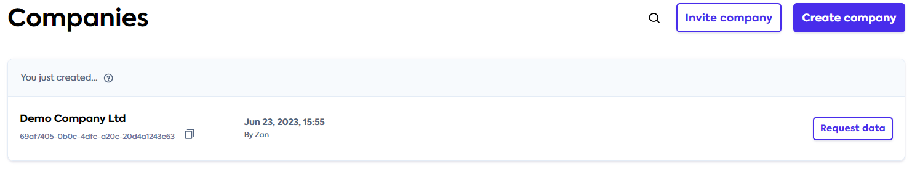

# sdk-link

<h2 id='create-company'>Create a new company</h2>

All of these examples will require you to have created a company and retrieved its `companyId`. You can do this via the [Portal](https://app.codat.io/).
Visit [codat.io/companies](https://app.codat.io/companies)

1. Click `Create company` button.
2. Fill in the form in an open modal and submit it via `Add company` button.
3. Copy `Company ID` by clicking on a `clipboard copy icon`.
